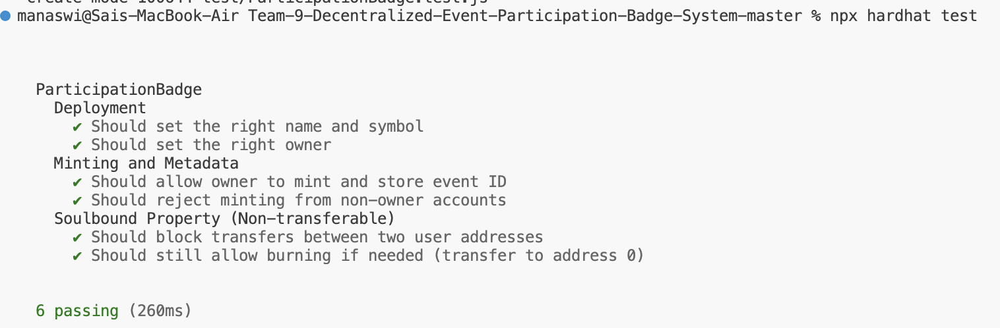

# Decentralized Event Participation Badge System

## Overview
Current event verification (e.g., Luma confirmation emails or screenshots) relies on centralized platforms and is easily forged. This project implements an independent, blockchain-based verification system using **Soulbound Tokens (SBTs)** to provide immutable attendance records.

By bridging off-chain registration data (Luma) with the **Base blockchain** via a Chrome extension, we issue non-transferable badges that serve as verifiable credentials for participants.

## Team - 9
- **Chandra Shekhar Pavuluri**
- **Yuvraj Rasal**
- **Siddanagouda Patil**
- **Sai Manaswi Seela**
- **Harshit Kumar Metpally**

## System Components
- **Soulbound Tokens (ERC721)**: Non-transferable badges tied to a specific wallet address.
- **Chrome Extension**: Acts as a bridge between Luma event pages and the smart contract.
- **Base Network**: Layer 2 solution chosen for low gas fees and EVM compatibility.
- **MetaMask**: Handles transaction signing and wallet connectivity.

## Repository Structure
- `/contracts`: Solidity smart contracts (SBT implementation).
  - [interface_ParticipationBadge.sol](file:///Users/manaswi/Downloads/Team-9-Decentralized-Event-Participation-Badge-System-master/contracts/interface_ParticipationBadge.sol): The formal interface defining the contract's public API.

## Smart Contract Interface
The system is built around a standard interface to ensure consistency across the Chrome extension and the Base network.

```solidity
interface IParticipationBadge {
    // Mints a badge for an attendee
    function mintBadge(address to, string memory eventId) external returns (uint256);

    // Returns event ID for a given badge
    function getEventForBadge(uint256 tokenId) external view returns (string memory);
}
```

### Prerequisites
- Node.js (v18+)
- Hardhat
- MetaMask

### Installation
```bash
git clone https://github.com/Manaswi875/Team-9-Decentralized-Event-Participation-Badge-System
cd Team-9-Decentralized-Event-Participation-Badge-System
npm install
```

### Testing
We use Hardhat and Chai to ensure the contract functions as expected. The test suite covers deployment, owner-only minting, and the "Soulbound" token property.

### Running Tests
To run the full test suite locally:
```bash
npx hardhat test
```

### Test Results


## Deployment
The contract is intended for the **Base** network. Follow these steps to deploy to Base Sepolia (Testnet).

### 1. Configure Environment
Create a `.env` file in the root directory and add your private key and RPC URL:
```env
PRIVATE_KEY="your_private_key_here"
BASE_RPC_URL="https://sepolia.base.org"
```

### 2. Compile to ABI
```bash
npx hardhat compile
```

### 3. Execution (Base Sepolia)
```bash
npx hardhat run scripts/deploy.js --network base-sepolia
```
*Note: Make sure your account has enough Base Sepolia ETH for gas.*

